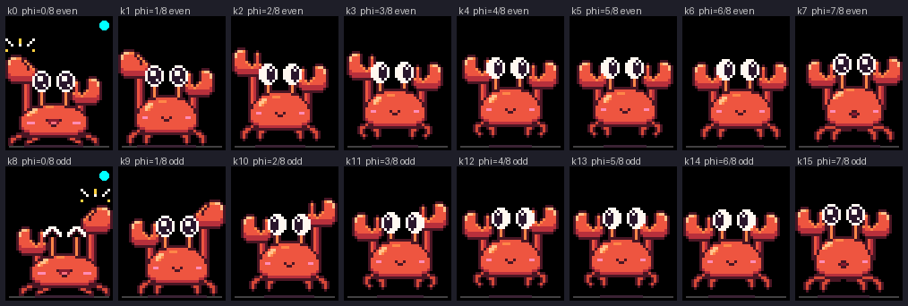

# Dancing figure: proof of concept

A dancer on the Core2's screen that dances to what is playing: it hops and
lands on the beat, over Bluetooth and on the speaker. This is a proof of
concept for a mascot. The first dancer was a stick figure; the default is now
a pixel-art crab (see [The crab](#the-crab-crabpose-crabart)), and `m` or a
tap on the dancer swaps between the two. The questions it answers:

- Can the Core2 find the beat by itself? mStream has a BPM for only 2.7 % of
  the user's library, and a whole-number BPM drifts off the beat within
  10-20 s anyway.
- Can it draw at 25-30 fps while it streams audio? The LCD and the SD card
  share one SPI bus.
- Does it cost too much internal RAM or IRAM?

Everything that can be tested on the laptop is in `lib/core` and covered by
`pio test -e native`. The Core2 side in `src/` is thin.

## Design

```
 decode task ─► PcmRing ─┬─► BtSink::onData (BTC_TASK) ──┬─► gain ─► SBC ─► headphones
                         │                               └─► AudioTap (copy only)
                         └─► SpeakerSink pump ───────────┬─► M5.Speaker ─► I2S DMA
                                                         └─► AudioTap (real frames only)
 loop task (core 1, prio 1):
   TapReader ─► BeatTracker ─► grid ─┐
   TapReader clock − output latency ─┴─► phase at the heard frame ─► CrabPose | DancePose ─► DanceView ─► LCD box
```

### The output tap (`AudioTap`, `TapReader`)

Each output has its own `AudioTap`: a ring of 32768 mono frames
((L + R) / 2, 64 KB of PSRAM). The output's own task is the only writer.
`BtSink::onData` writes all `want` frames after the de-click reader's fill and
before the gain stage. The speaker pump writes after `reader_.pull()`, and
only the real frames, never the fade it appends. The writer copies and
publishes: a free-running 32-bit frame counter (release/acquire) and a 32-bit
microsecond timestamp of the last write. It uses no locks and no 64-bit
atomics, since those aren't lock-free on the ESP32.

Each write also records where its audio came from, which the tap keeps as
**segments**. `PcmRing::read()` now reports the epoch and the first frame's
position in it. That position is frames since the `discardAll()` that began
the epoch, the same count `positionMs()` is made of. `DeclickReader::Result`
passes both on. A new segment starts wherever the track position doesn't
continue: a skip (new epoch), a pause, an underrun, or silence and fades
(those are marked "no track"). So any recent tap frame can be placed in its
track, and beat times are compared with the ground truth in track frames.

On the loop task, `TapReader`:

- hands the new real audio to the tracker as runs, each with its track
  frame and epoch;
- keeps a clock that follows the leading edge of the writes. The outputs
  write in bursts (Bluetooth pulls ~30 ms at a tick, the speaker 23 ms at a
  time). The clock runs at the sample rate, jumps up to any write ahead of
  it, sags 0.3 % so a slightly slow writer can't leave it behind, and starts
  over after a stall of more than 60 ms;
- works out the audible frame: that clock minus the output latency, never
  later than the last frame written. More than 60 ms past it nothing is
  being heard (the speaker writes nothing while paused, stopped or
  starved), so the frame is invalid and the figure fades to its idle sway
  instead of holding a pose mid-hop.

The tracker starts over on an output switch, a new epoch (a skip or track
change), or a gap in the track frames (frames lost because the loop fell a
capacity behind). A pause or an underrun doesn't restart it: the tracker
runs in track frames, so the audio on either side of the gap still lines up.

### Output latency

- **Bluetooth:** the headphones' AVDTP delay report (now stored on every
  report, `BtSink::delayReportUs()`; 150 ms on the Powerbeats Pro) plus
  25 ms for ESP-IDF's queue and the air. Without a report it assumes 150 ms.
- **Speaker:** measured. The pump notes when it fills each buffer, and
  `onBufferReleased` smooths the time until M5.Speaker releases it, which is
  when M5.Speaker has mixed all of it into the I2S DMA. On top of that comes
  the DMA's depth (8 × 256 frames, 46 ms). Until the first buffer is timed
  it assumes 115 ms.
- `y<ms>` adds a user offset (+ later, − earlier). It isn't saved.

Each frame is drawn for the moment it will be on the LCD: now, plus the
drawing time, plus half the push time. The figure is aimed 15 ms early,
inside the 0-30 ms window where a movement ahead of the sound still looks on
the beat.

### Beat tracker (`BeatTracker`)

This is portable and allocation-free after `begin()`. Its scratch memory
(~9 KB: onset history, autocorrelation, tempo tables) comes through an
allocator hook, which the firmware points at PSRAM. Anything under 4 KB that
the firmware mallocs lands in internal RAM, so the hook matters. Time is
counted in the caller's frames, the track frames of the tapped audio. It
never reads a clock.

The first version (linear low-band flux, tempo from a lag and its double,
confidence from the share of onsets near beats and half beats) was perfect
on the click tracks and weak on real music. Replayed over the ground truth
of the 77 tracks on the SD card (see Device results), it was locked on the
beat only 30 % of the time on the tracks with a clear beat, took a median
12 s to lock, picked a 4:3 or 3:4 tempo on 17 of 59 tracks, and sat 20-40 ms
behind the beat on most of the rest. The design below is the rework.

1. **Onset signal.** The audio is box-averaged 8× down to 5.5 kHz, DC
   blocked, and split by a 150 Hz low-pass (fourth-order Butterworth as two
   biquads) into a low band (kick drums, bass) and the rest (mid: snares,
   chords, up to 2.7 kHz). Each band's energy is summed per 512-frame hop
   (86 Hz). The onset strength is the rise in **log** energy from one hop to
   the next, scaled down while the band is below its recent level (quiet
   tails, near silence): low band + mid band + a little of the low band's
   linear rise. The log rise marks the first hop of an attack. A linear
   energy flux, which the first version used, puts a real kick drum, whose
   body builds over 20-40 ms, that much late. The linear term keeps the
   loudest hit the beat: a log rise alone hardly tells a kick from an
   off-beat bass note or ghost kick, and put the grid on those in 10 of the
   32 heavy off-beat test cases. The mid band weighed half the low band
   until the evaluation harness (October 2026) showed equal weight finds
   the beat sooner and more often on real music (snares and chords carry
   it where the kick is soft or the bass sits on the off-beat). The levels
   and the onset's mean are true means until their leaky ones have settled
   (1.5 and 3 s): started from zero, the leaky mean sat low for its first
   seconds, the centred onsets came out positive on average, their
   autocorrelation was positive at every lag, and the comb then rewarded
   the shortest lags, so every noise was "185 BPM" at 1.9 s.
2. **Tempo.** A running autocorrelation of the onset signal (3 s memory,
   lags up to 8 s) is scored at 241 candidates from 60 to 200 BPM, spaced
   0.5 % apart. Each candidate scores with its own lag and the next 7
   multiples (weights 1, 1, ½, 1, ½, ½, ½, 1: beats, half bars, bars). A
   steady beat correlates at every multiple, while a 4:3 or 3:2 relative
   (dotted notes, triplets, swing) only correlates at some, which removed
   most metrical errors on the hip-hop and downtempo tracks. The score is
   weighted towards 120 BPM (log-Gaussian, 1 octave wide). With a prior
   (`t<bpm>`) the weight centres on the prior and is 0.25 octave wide, so
   the prior picks the octave. Only a tempo whose own lag correlates may
   win: a prior of 180 on a 90 BPM track stays at 90, because a prior can't
   invent the beats in between. The pick is refined parabolically. Its
   clarity counts only the multiples the history already reaches, so a
   clear beat is acquired after 1.5 s, before 8 periods have been heard.
   The cost: after an abrupt tempo change the old tempo lingers in the long
   lags, and the new one is locked 7-8 s later (the first version: 6 s).
3. **Phase.** The last 3 s of onsets are folded at the period into 64 bins.
   The strongest pulse is then refined to the onset-weighted centroid
   within ±1/8 beat.
4. **PLL.** Each predicted beat collects the onsets in a window of
   ±0.2 beat (flat to ±0.1). Their centroid is the phase error e. The next
   beat moves by 0.35 e and the period by 0.06 e (critically damped), and
   the period is clamped to ±4 % of the tempo it was acquired at. If
   another tempo keeps scoring 25 % better for ~1 s (sooner once the lock is
   gone), the tracker re-acquires. (The October 2026 rework also moved the
   grid to a quarter, half or three-quarter phase that kept out-gathering
   it; its review measured no gain in F and more false locks, and took it
   out.)
5. **Confidence.** A leaky 16-bin histogram of the onsets by phase of the
   beat (3 s) and the PLL's own bookkeeping give three signs of a real beat,
   each scaled 0..1 and multiplied:
   - **dominance**: the onset energy in the three sixteenths around the
     grid's beats against the strongest of the quarter, half and
     three-quarter phases (from 1.0 to 1.8). A grid on the off-beat or on a
     sixteenth sees the real beat out-gather it; a grid at a 4:3 tempo
     drifts through the phases and gathers nothing in particular;
   - **hits**: the share of recent PLL beats whose window held an onset
     (from 0.3 to 0.8; a miss counts faster than a hit, so a beat that
     stops is let go of in a few beats);
   - **pulse**: the same three sixteenths against an average sixteenth
     (from 1.2 to 2.5; noise gives about 1). Eighths and sixteenths
     between the beats lower it but leave the beat standing out.

   The first version multiplied a one-sixteenth salience, the PLL's
   jitter and the tempo clarity. On the harness those three told an
   on-beat grid from a wrong one no better than a coin toss once the lock
   was lost, and left the right grid unlocked for a third of every track
   (BEAT-TRACKER-EVAL.md). The histogram and the hit share are seeded from
   the acquisition window, so a clear beat locks at its second PLL beat as
   before; what keeps noise out is that noise no longer acquires a grid at
   all (the true means above). Locked uses hysteresis: it comes on once
   the confidence has been at 0.35 or more for two PLL beats in a row (no
   sooner than the second after acquiring), and goes off below 0.12. The
   two beats keep a lock from flapping on and off on a grid at the wrong
   phase, the commonest false lock on the harness. Twelve beats in a row
   under 0.1 drop the grid. `factors()` shows the three signs, for logs
   and the harness.

Cost: 13.3 ms per second of audio on the Core2 before the rework (1.3 % of
a core, measured at boot by `[dance] tracker bench`; the rework adds a
per-hop histogram decay and per-beat sums, within the noise on the laptop
once the build's code alignment is pinned; not yet measured on the
device). An acquisition reads only its 3 s window, however long since the
last reset (a gapless album never resets).

How well it does on real music, track by track, is measured by the
evaluation harness in [BEAT-TRACKER-EVAL.md](BEAT-TRACKER-EVAL.md): the
same tracker on the whole of the 77 library tracks, the click tracks,
mid-song starts and gapless joins, scored against the reference beats. The
October 2026 rework of steps 1, 4 and 5 above, and its review, were made
against it: on the 69 tracks with a beat, the beat F-measure went from
0.40 to 0.49 (0.48 to 0.56 on a monitored third of the tracks), the time
locked from 42 % to 50 % and the time the figure dances from 41 % to 46 %,
the on-beat lock from a median 9.0 s to 6.6 s, the wrong locked beats from
16 % to 13.5 % and the false-lock episodes from 199 to 141, with the click
tracks unchanged. Opened mid-song the wrong locked beats are 14.5 %
against 13.9 %, and the gapless joins have 81 false episodes against 69;
four tracks got worse where the off-beat is as strong as the beat
(BEAT-TRACKER-EVAL.md).

The output is `bpm()`, `confidence()`, `locked()`, and the `grid()`: a beat
at frame + fraction, its index, and the period in frames. The renderer turns
that into a beat count at any audible frame. The dance rate is the tracked
tempo folded into 80-160 BPM (`dance::danceStep`), so the figure dances
174 BPM drum & bass at 87 and 70 BPM at 140. The fold is kept between
frames with some hysteresis (`dance::TempoFold`): the PLL moves the tempo a
little on every beat, so a track right at 160 or 80 BPM would otherwise
cross the edge and back every beat or two, and the figure would jump
between hopping on each beat and on every other one. A fold stays while the
folded tempo is within 72-176 BPM, and is chosen afresh when it leaves that
band or the tracker restarts.

The `[dance]` line's `tracker` share is wall time on the loop task, so it
includes the decode task preempting it: 3-7 % while an MP3 plays, against
the 1.3 % the boot bench measures on its own.

### Click tracks (`ClickGen`)

The built-in tracks are `tone:click90`, `click120`, `click128`, `click140`,
`click174` and `click120off`, each 60 s. Each click is 15 ms: a thump gliding
from 100 to 60 Hz plus a 2 kHz tick. The downbeat peaks at exactly −12 dBFS
and the others are 4 dB softer. Beat k is at exactly offset + round(k × 60 /
bpm × 44100) frames. For `click120off` the first beat is at 0.37 of a period
(frame 8159). Because the firmware knows this truth, it measures the phase
error live. It feeds the tracker up to each true beat and scores the grid as
it stood at that moment (a prediction, the same as in the host tests),
modulo the true period: a grid at half the tempo is on the beat too.

### The stick figure (`DancePose`, `DanceView`)

The poses are pure functions of (phi, the beat index's parity). `Dancer`
adds the confidence and dt. Following Takehana et al. (2019), ground contact
and the extreme poses land on the beat:

- a hop of 10.5 sin(π phi) px, with contact at phi = 0 (the feet lift
  7 px at the top; the first version's 7 px hop lifted them 4 px, which was
  hard to see on the device);
- a squash on impact, deepest at phi 0.03 (under a frame) and gone by 0.2;
- an anticipation stretch over phi 0.85-1;
- the head lowest 0.1 beat after the impact;
- the arms alternating each beat, each at its extreme on the beat (the
  raised fist straight up, the shoulders wide enough that the raised arm
  clears the head), and the hips swaying with them.

The pose is continuous across beats. Legs use two-bone IK. Unless the
tracker is locked, or as its confidence nears the unlock level (the dance
weight is 0 at 0.12 and 1 at 0.5; a fresh lock at 0.35 shows 0.65), the
figure blends over ~0.4 s into an idle sway, drawn in grey. A lost beat
holds its last pose while it fades.

The figure is drawn with anti-aliased `drawWideLine` (5 px) and smooth
circles into a 120×150 8-bit `M5Canvas`. `setPsram(true)` comes before
`createSprite()`, so the sprite takes 18 KB of PSRAM and no internal RAM.
Only the part that changed is redrawn and pushed, once per frame, at
~30 fps: the rectangle around the figure now and in the last frame, and the
beat dot's corner when it changes. M5GFX copies a PSRAM sprite to the panel
with the CPU (no DMA), so pushing the whole box cost 8.5 ms of the loop's
core per frame, 13-15 ms while an MP3 decoded; the rectangle takes 4-8 ms.
A push takes the SPI bus (and with it the SD card's lock) for that push
only. The loop task stays at priority 1, draws on a 33 ms schedule, and
keeps its `delay(5)`, so IDLE1, the decode task and the speaker pump always
get their time. The now-playing screen isn't drawn while dancing.

The screen has a title bar ("Dance: <track>", plus `[silent]` in silent
mode), the dancer, a line of numbers (the dancer's name, bpm, confidence,
locked, fps) redrawn at 2 Hz and only when it changes, and the button labels.
A cyan dot flashes on each beat.

### The crab (`CrabPose`, `CrabArt`)



The default dancer: a round red crab with eyes on stalks, blush, a face that
changes with the beat, jointed legs, and two big pincers (a fat fixed finger
and a thin movable one with a V between them). It was chosen from three
designs (kawaii, arcade, party) by how well it reads as a crab at 320×240,
its charm, how clearly it marks the beat, its idle, and how well it fits the
existing box. The kawaii design won, and took over from the others the
pincer shape, the snap spark, the eyes looking where the crab travels, and
the contact shadow. The arms are a red 4-px tile, so they don't read as a
second pair of eye stalks.

**Art.** 13 layer frames (body, squash and stretch bodies with the face
baked in; eyes, squinting eyes, glancing eyes; open and shut claws; the arm
tile; standing, splayed and tucked legs; the spark) in a 16-colour palette,
1382 bytes packed two pixels to a byte. Index 0 is transparent; 13-15 are
the contact shadow, the ground line (the stick figure's 0x4208) and the beat
dot (its cyan), which the view draws itself. `tools/art/crab.json` is the
source (palette, idle palette, frames as text grids, where each layer sits);
`python tools/crab_art.py` generates `lib/core/CrabArt.h` and `CrabArt.cpp`
(const arrays in a .cpp, so they are in flash, once), and
`python tools/crab_art.py --check` fails if they are stale.

**Motion** (`crab::dancePose`, pure functions of phi and the beat's parity;
a two-beat cycle, u = parity + phi). Contact and the extremes land on
phi = 0:

- **Hop:** on the ground and squashed (squash body, splayed legs, an open
  grin) for phi < 0.12, then a parabola, dy = −9 · 4a(1 − a) with
  a = (phi − 0.12) / 0.88: highest at phi 0.56, and down hard exactly on the
  next beat. The legs tuck up mid-air (phi 0.3-0.7).
- **Side-step:** ±6 px with a smoothstep over phi 0.12-0.92. The even beat
  travels left to right and the odd one back, so every beat is at a side
  extreme.
- **Anticipation:** the stretched body with an "o" mouth from phi 0.84.
- **Claws:** the left punches on even beats, the right on odd ones:
  lift = 1 + round(8 · pulse), the pulse rising as x² over the last 0.22 beat,
  at its top on the beat, falling with a smoothstep over 0.7 beat. The
  beat's claw is shut (the snap) for phi < 0.16, and a white and gold spark
  sits over it while the body is squashed (phi < 0.12).
- **Eyes** (the lagging secondary element): offset by where the body was
  0.12 beat earlier less where it is, /3, clamped to ±2 native px, so the
  stalks trail the hop and the step. Mid-air (phi 0.2-0.8) the pupils look
  where the crab travels; on odd impacts the eyes squint (^ ^), so the face
  alternates each beat.
- **Contact shadow:** 66 px wide on the ground line, 2 px narrower per px of
  hop.

**Idle** (`crab::idlePose`) is a loop, not a still: breathing (the body,
claws and eyes bob 1.5 sin(2π t / 2.6 s) px while the legs stay planted),
the claws tucked low and each twitching up and snapping for 0.25 s on its
own 2.9 s or 3.3 s cycle, a glance to each side on a 5.3 s cycle (the
glancing eyes plus a pixel), the eyes settling a pixel on the out-breath, and
a 0.16 s blink every 3.7 s. It is drawn in the idle palette: the same indices,
half grey and dimmed.

**Blending** (`crab::Crab`, the crab's `Dancer`): the dance weight follows
the tracker's confidence exactly as the stick figure's does (only while it
is locked: 0 at 0.12, 1 at 0.5, over ~0.4 s; a lost beat holds its last
pose while it fades).
Offsets and claw lifts lerp from the idle to the dance, the frames switch at
a weight of 0.5, and the palette fades channel by channel in 32 steps.

**Drawing.** The crab's sprite is a 120×150 **RGB565** `M5Canvas` (36 KB
of PSRAM; RGB332 would turn its reds pink and its legs brown). The first
version used a 4-bit palette sprite (9 KB), which is exact too, but M5GFX
converts every pixel through the palette while it pushes, and on the device
that push held the SPI bus (and the SD card) ~1.6 ms a frame longer while
an MP3 played (see Device results). In RGB565, the panel's own format, the
push is a plain copy. Each layer is blitted at an integer 3× as
`fillRect()`s of one palette index, which `DanceView` maps to the RGB565 of
the current palette step: a run of one index in a row is one rectangle, and
so is the same run repeated in the rows below it, so a whole crab is ~210
rectangles (the arm tile is one rectangle per column however long the arm).
Nothing is smoothed or anti-aliased. The dirty rectangle is the crab's
layers and its shadow, now and in the last frame: that holds every crab
pixel, so when the palette fades every crab pixel is redrawn in the new
colours (the background, shadow, ground and dot entries are the same in both
palettes). It averages ~11,800 px a frame at 90-140 BPM against the stick
figure's ~10,800 px (at most 13,200 px for both, of 18,000 in the box). The
beat dot is a plain `fillCircle`, as crisp as the crab. A skin switch
deletes the sprite and creates it in the other format (8-bit for the stick
figure), and the next frame pushes the whole box.

**Skins** (`DanceSkin`): `m`, or a tap inside the dancer's 120×150 box
while dancing, cycles crab → stick → crab; a tap elsewhere above the button
strip still leaves the dance screen. The new dancer starts at the old one's
dance weight, so a switch mid-song doesn't fade out and back in. The choice
isn't saved: every boot starts with the crab. `k<n>`, `x` and `X` work for
both.

On the device: see [The crab on the Core2](#the-crab-on-the-core2).

### Silent test mode

`z` pins the output to the speaker at volume 0 until restart. The speaker
is muted before it takes over the ring (its pump preempts the loop, so
muting after the switch could let a buffer play at the old volume). Headphones
connecting don't switch the output, and neither do `o`, a hold on the middle
button, or their play key. The speaker keeps running (M5.Speaker mixes at
master volume 0, so the pump, the tap and the latency measurement all work).
The mode shows in `[stats] out=speaker(silent test mode)`, the `[dance]`
line and the title bar. All device tests of this proof of concept run in it.

## Commands

| Key | Action |
|---|---|
| `z` | silent test mode (until restart) |
| `d`, or the Dance tab | the Dance tab (the UI's, since the tab bar; `d` again goes back to the tab you were on). The old "tap the screen to dance" is gone |
| `m`, or a tap on the dancer's box on the Dance tab | next dancer: crab (default) → stick figure → crab |
| `s` | stats, including the `[dance]` line (also every 5 s while dancing) |
| `v` | a `[beat]` line per tracker beat on/off |
| `x` | screenshot of the dancer's box |
| `X` | screenshot of the whole screen (~20 s at 115200 baud) |
| `t<bpm>` + Enter | tempo prior; `t` or `t0` clears it, and so does a track change |
| `y<ms>` + Enter | latency offset, + later / − earlier (not saved) |
| `k<n>` + Enter | freeze the dancer (either one) at phase n/8 of a two-beat cycle (0-7 even beat, 8-15 odd); `k` alone follows the beat again |

The `[dance]` line has these fields:

- `skin`: the dancer (`crab` or `stick`).
- `fps`, `draw`, `push`: frame rate (measured over the last second / the
  target, and the mode: `fps=23.8/24 (dancing)`), and the smoothed drawing
  and SPI push times in ms. Since ENERGY.md item 8 the target is 10 fps
  while the dancer idles and 30 (240 MHz) or 24 (below) while it dances;
  each change is logged (`[dance] 10 fps (idle)`).
- `bpm`, `conf`, `locked`, `lock_after`: the tracker's tempo, confidence and
  lock, and the time from the tracker's last reset to its first lock.
- On click tracks, `err_med`, `err_p95` and `err_mean`: the phase error over
  the last 10 s.
- `latency`: the latency used and how it was found, plus the offset.
- `tracker`: the tracker's share of the loop core.
- `resets`, `lost`: tracker restarts, and tap frames lost because the loop
  fell behind.
- `ram`, `min`: internal heap free now, and the lowest since boot.

The log also shows `[dance] tracker reset (<why>)`, `[dance] locked` and
`[dance] lost the beat` as they happen.

### Screenshots

`x` and `X` read the rectangle back from the LCD (`M5.Display.readRect`,
8 rows per SPI transaction) into PSRAM, then print one base64 row per loop
pass:

```
[shot] format rgb565 big-endian, one base64 line per row[, note]
[shot] begin <x> <y> <w> <h>
...
[shot] end
```

The Core2's ILI9342C is readable by M5GFX (16 MHz read clock). The readback
is checked against the sprite where the two overlap. If more than 2 % of the
pixels are off by more than one step per channel, or the panel isn't
readable at all, the sprite's own pixels are dumped instead, and the format
line says so. Printing a row blocks the loop for the time the UART takes
(~28 ms per row of the box at 115200 baud), so the figure runs at about half
its frame rate while a screenshot prints. The host script `shot.py` (pyserial; COM3 opened with DTR and
RTS low, so the ESP32 isn't reset) sends the keys and writes PNGs (Pillow)
or PPMs:

```
python shot.py --pre z --pre i64 --pre d --wait 8   # silent, play track 64, dance
python shot.py --poses --scale 2                    # k0..k15 plus a contact sheet
python shot.py --full
```

## Host results (September 2026)

`pio test -e native`: all 269 cases pass (234 before this work, 35 new;
after the device run's tracker rework). The new
suites are `test_beat_tracker`, `test_audio_tap` (which includes the ring's
position reporting), `test_click_gen` and `test_dance_pose` (which includes
the helpers).

With the crab: 284 cases (15 new in `test_crab_pose`, and the stick
figure's weight hand-over added to `test_dance_pose`). `test_crab_pose`
checks:

- the generated art: frame sizes, index ranges, the view's palette slots
  unused by the frames, the ground and dot colours equal to the stick
  figure's;
- against the Python rig the crab was designed with: the 16 frozen phases
  k0-k15 field by field, and the pixels (FNV-1a of the box) of those, of 16
  idle moments and of 16 blends;
- contact and the extremes on phi = 0 (on the ground, squashed, at a side
  extreme, the beat's claw at its top and shut, the spark), the hop's arc,
  the anticipation, continuity across beats and from frame to frame at
  160 BPM, the eyes trailing and looking where the crab travels;
- every pose inside the box, the dirty rectangle holding every pixel drawn
  and the shadow, the shadow narrowing with the hop;
- the idle loop (feet planted, claws tucked, blinks, glances both ways, the
  legs not bobbing), the blend, the weight fading in and out, the palette
  fade;
- the blitter (3× blocks, transparency, the mirror, merged runs, under 240
  rectangles a frame) and the skin cycle.

Click trains with white noise at −30 dBFS RMS. The phase error is the grid's
prediction for each true beat, scored from 4 s after the start:

| BPM | Lock | Median error | p95 |
|---|---|---|---|
| 90 | 2.8-3.1 s | 1.9-2.4 ms | 3.0-3.3 ms |
| 120 | 2.6-2.8 s | 2.5 ms | 5.7-5.8 ms |
| 128 | 2.6-2.9 s | 2.2-2.6 ms | 3.2-3.3 ms |
| 140 | 2.7-2.8 s | 2.2-2.6 ms | 4.5-4.6 ms |
| 174 | 2.5-2.6 s | 2.5 ms | 3.1-3.2 ms |

(The first version locked in 1.5-2.1 s with medians of 1.0-2.2 ms; the
rework waits 1.5 s of audio and two PLL beats before it may lock, so noise
can't lock on a first lucky estimate.)

The targets were a lock within 4 s, a median under 10 ms and a p95 under
25 ms. Other results:

- **Drums with a hi-hat at 0 dBFS** on the off-beat, straight or swung,
  lock on the kick. The hat has almost nothing in the 150 Hz band, so this
  only shows the band shuts it out. The off-beat content the tracker hears
  is tested separately, at 0.5 (straight) and 0.66 (swung) of the beat: a
  70 Hz bass note 6 or 8 dB under the kick, a second, quieter kick 6 or
  10 dB under it, and both at once (−8/−10 dB) at 96 and 150 BPM. All lock
  on the main kick and stay locked (median ≤ 2.2 ms, p95 ≤ 5.9 ms).
- **Heavier off-beat low band** (bass and second kick together 4-6 dB under
  the kick, as loud as the kick itself, at 0.5, 0.66 and 0.75 of the beat,
  96-150 BPM): locked for all 1016 beats scored, always on the main
  kick (the first version refused to lock for 617 of them). One case was
  left out: 150 BPM with both 4 dB under the kick at 0.75 (a 16th
  before the beat), where the lead-ins together are louder than the kick.
  A log-energy onset alone put the grid on the off-beat notes in 10 of the
  32 cases; the small linear term in the onset is what fixed it. Since the
  October 2026 rework (the mid band at full weight, the confidence from
  the grid's dominance) the tracker locks on the lead-in in 11 of the 36
  cases (124 and 150 BPM at 0.75, 150 BPM at 0.66, with either note 4 dB
  under the kick): there the lead-in with the hat on top gathers more
  onset energy than the kick in the tracker's bands. These are known
  failures: the test lists the 11 and stays strict on the rest (a case
  that leaves or joins the list fails it). In 9 more it doesn't lock at
  all (the straight off-beat as loud as the kick at 124 and 150 BPM, and
  96 BPM at 0.75): with the two phases equal, no phase dominates. The
  harness runs the same 36 cases (`drums_*`).
- **Tempo changes** (120→135, 128→96, 140→128) are locked again on the new
  tempo within 8 s (the first version: 6 s), p95 < 4 ms from then on. The
  old grid is dropped ~1.5 s after the change, so the figure sways rather
  than dancing off the beat in between.
- **Silence, ambient noise and white noise** never lock (12 seeds of each
  in the replay harness), with a mean confidence of at most 0.04. When a
  beat stops, the lock goes. Since the rework white noise never even
  acquires a grid (`test_noise_from_a_reset_never_acquires`, six seeds):
  before, every noise was "185 BPM" at 1.9 s and only the confidence kept
  it unlocked.
- **Half and double tempo.** 174 BPM without a prior is tracked at 174 or 87
  and danced at 87. A prior of 174 or 87 picks the octave. 70 BPM is danced
  at 140.
- **Heavier noise** (−20 dBFS RMS, above the softer clicks' level) still
  locks, in 2.6-3.0 s, p95 ≤ 12 ms (replay harness, 3 phases per tempo).
- **Real music**: see Device results, which include a laptop replay of the
  tracker over the SD card's tracks against their ground truth.

On the click tracks the mean signed error is about −2.8 ms (the log onset
marks the first hop of an attack); on real music the median bias is +2 ms.
`kOnsetDelayFrames` stays 0.

## Build (September 2026)

Compared with the same build of HEAD before this work (`git archive` of
ad6c844, same libraries):

| | Before | After | Change |
|---|---|---|---|
| IRAM (`.iram0.vectors` + `.iram0.text`) | 124,035 B | 124,035 B | 0: the same 1047 symbols |
| Internal `.dram0.data` + `.dram0.bss` | 49,184 B | 50,984 B | +1,800 B (`danceMode` 1,552 B) |
| Flash (text + rodata) | 1.46 MB | 1.51 MB | +47 KB |

At run time these come from the heap:

- **Internal RAM:** two `AudioTap` objects (~150 B each).
- **PSRAM:** 2 × 64 KB of tap history, 18 KB of sprite, 4 KB of scratch,
  ~9 KB of tracker memory, and the screenshot buffers only while one is
  printed.

On the device the dance screen lowered the internal heap's minimum by ~2 KB
while an MP3 played (M5GFX's push buffers), and its free level not at all
(see Device results).

The crab, against the same build of 0de17ea (`git archive`, same libraries):

| | Before | After | Change |
|---|---|---|---|
| IRAM (`.iram0.vectors` + `.iram0.text`) | 124,035 B | 124,035 B | 0: the same 1047 symbols |
| Internal `.dram0.data` + `.dram0.bss` | 50,984 B | 51,056 B | +72 B (`danceMode` 1,608 B: the crab's state, its 16 RGB565 colours and the skin) |
| Flash (`.flash.text` + `.flash.rodata` + `.eh_frame`) | 1,542,312 B | 1,549,600 B | +7,288 B (1,382 B of them pixels, 96 B palettes) |

At run time the crab's sprite takes 36 KB of PSRAM instead of the stick
figure's 18 KB (on the device: 3578K PSRAM free with the crab, 3596K with
the stick figure) and no internal heap.

## Device results (September 2026)

Core2 v1.3 on COM3, all in silent test mode (`z` after every boot; the
Powerbeats Pro connected and idle, the log showing `[test] silent mode:
staying on the speaker` and `out=speaker(silent test mode)` before anything
played). Two rounds: **round 0** is the code as first written, **round 1**
has the fixes below. The logs and scripts are in the session scratchpad
(`dev_round0.log`, `dev.log`, `real.py`, `clicks.py`, `replay/`).

What round 1 changed, from what round 0 showed:

- **Beat tracker on real music** (the big one; see the tracker section):
  log-energy onsets plus a mid band, tempo scored at 8 multiples of the lag,
  a salience confidence. Found by replaying the tracker on the laptop over
  the first 90 s of 67 of the 77 SD tracks (decoded with the device's own
  MP3 decoder chain) against the ground truth; the replay reproduces the
  device's lock times and phase errors to a few ms.
- **Only the changed rectangle is pushed** (M5GFX pushes a PSRAM sprite
  without DMA): push 13-15 ms → 4-8 ms while an MP3 decodes.
- **Frames on a 33 ms schedule** instead of 33 ms after the last one.
- **A bigger hop** (feet 7 px off the ground instead of 4) and wider
  shoulders (the raised arm cut into the head).
- **`[dance] tracker bench`** at boot: the tracker's own cost.

### Boot, heap, IRAM

- IRAM unchanged: `.iram0.vectors` + `.iram0.text` = 124,035 B, as at
  ad6c844. No crash or reset in either round (47 and 40 minutes of uptime,
  dozens of track changes).
- `[heap]` at boot: `audio` 89K, `[diag] RAM free` 68K, `dance` 69K free
  (min 67K). Creating the dance screen, tracker and taps takes no internal
  RAM (all PSRAM: 3633K → 3584K free).
- Idle with the headphones linked: 67K free, min 62K (the minimum comes from
  the Bluetooth link, not from dancing).
- MP3 playing (One More Time), dance screen **off**: 50K free, min 50K;
  **on**: 50K free, min 48K. FLAC with dancing: 52-53K. So the dance screen
  costs ~2K of internal RAM at its worst moment (M5GFX's push buffers),
  inside the 4 KB budget.
- Tracker bench: **13.3 ms per second of audio, 1.3 % of a core** (the
  first estimate was "well under 1 %"). The `[dance]` `tracker` share reads
  3-7 % while an MP3 plays because it is wall time on a preempted task.

### Click tracks (speaker, silent)

Every beat from the lock on, scored against the known grid (the live
`[beat]` log; `clicks.py`):

| Track | Round 0 lock | Round 0 median / p95 | Round 1 lock | Round 1 median / p95 | Tempo (round 1) |
|---|---|---|---|---|---|
| click90 | 2.14 s | 1.1 / 8.9 ms | 2.83 s | 2.6 / 3.5 ms | 90.00 |
| click120 | 1.63 s | 2.2 / 5.9 ms | 2.62 s | 2.4 / 5.7 ms | 120.01 |
| click128 | 1.53 s | 0.7 / 2.4 ms | 2.93 s | 2.6 / 3.5 ms | 128.00 |
| click140 | 1.83 s | 2.2 / 3.7 ms | 2.67 s | 2.8 / 4.9 ms | 140.01 |
| click174 | 1.49 s | 1.3 / 2.7 ms | 2.51 s | 2.8 / 3.5 ms | 174.01 (danced at 87) |
| click120off | 1.81 s | 2.0 / 5.8 ms | 2.81 s | 2.4 / 5.7 ms | 120.01 |

Targets (lock ≤ 4 s, median < 15 ms, p95 < 30 ms, tempo within 0.5 %) are
met in both rounds. click120off locks on its offset phase (the error is
taken modulo the true period, so the other phase would show ~185 ms).
click174 is tracked at 174 and folded to 87 for the dance. Round 1 locks
~1 s later (it waits 1.5 s of audio and two PLL beats, so noise can't lock
on its first estimate) and sits ~2.8 ms early on clicks (mean signed error
−2.7 to −2.9 ms, round 0 −0.9 to −2.0 ms): the log onset marks the first hop
of the click.

Speaker latency, measured: queue 68.7 + DMA 46.4 = **115 ms**, steady.

### Real tracks from the SD card

Against `groundtruth/beats.json` (librosa-based, on the device timeline).
Each track played from its start (no seek exists) for 60 s without a prior,
then 45 s with `t<published tempo>`. Every `[beat]` prediction while locked is
compared with the nearest true beat; "lock" counts from the track's start,
intros included.

| # | Track | GT BPM | Round 0: lock, BPM, median / mean error | Round 1: lock, BPM, median / mean error |
|---|---|---|---|---|
| 23 | One More Time | 122.9 | 1.6 s, 122.88, 7.4 / +8.6 ms | 2.6 s, 122.86, 4.6 / +3.8 ms |
| 25 | Digital Love | 124.7 | 19.6 s, 124.83, 4.5 / +1.8 ms | 13.8 s, 124.72, 4.7 / +0.4 ms |
| 26 | Harder, Better, Faster, Stronger | 123.5 | 6.1 s, 123.44, 26.9 / +24.6 ms | 2.8 s, 123.51, 7.6 / +7.8 ms |
| 29 | Superheroes | 140.9 | 2.9 s, 140.85, 34.7 / +31.6 ms | 3.7 s, 140.82, 9.0 / +11.7 ms |
| 53 | Stronger | 104.0 | 14.3 s, 103.86, 34.9 / +34.8 ms | 3.9 s, 103.95, 8.7 / −21.2 ms (11 % of beats on the off-beat) |
| 65 | Blizzard | 112.0 | 21.6 s, 111.91, 41.4 / +38.3 ms | 13.6 s, 111.98, 11.0 / +10.8 ms |
| 70 | Testarossa Autodrive | 130.0 | 12.3 s, **65.0** (half), 39.6 / +39.7 ms | 2.9 s, 130.00, 15.1 / +15.3 ms |
| 71 | Nightcall | 91.0 | 20.9 s, 91.00, 34.3 / +34.6 ms | 15.6 s, 90.96, 29.7 / +30.4 ms |
| 14 | Aphex Twin – I (no clear beat) | – | never locked: idle sway | never locked: idle sway (screenshot) |
| 8 | Air – New Star in the Sky (hard) | 86.7 | never locked: idle sway | never locked: idle sway |

- **Tempo:** every clear track is within 0.12 % of the ground truth in
  round 1, at the right octave (round 0 danced Testarossa at half tempo).
- **Phase:** the median error on the 8 clear tracks fell from 7-41 ms
  (typically +30 ms late) to 5-30 ms (typically +8 ms late). Nightcall
  stays ~30 ms late (its beat is a soft, slow-attack kick). The figure is
  aimed 15 ms early, which covers most of what is left.
- **With the published tempo as a prior** the numbers barely move (e.g.
  HBFS 7.7 ms, Superheroes 8.0 ms, and Stronger no longer drifts onto the
  off-beat: 8.4 / +9.8 ms). The prior is useful for the octave, not for
  the phase.
- **Locking** is still slow where the intro has no beat: Digital Love,
  Blizzard and Nightcall lock 13-16 s in, when their drums start.
- **Ambient tracks** never lock; the figure sways in grey with "no beat".

The laptop replay over the first 90 s of all 67 decodable tracks
(`replay/all.py`; the other 10 are Aphex Twin MP3s the host decoder
couldn't open), share of beats locked on the beat ("good") or locked off
it ("bad"):

| | Round 0 | Round 1 | Round 1 with the GT tempo as a prior |
|---|---|---|---|
| clear tracks ("good", 29): on the beat / off it | 39 % / 8 % | 53 % / 5 % | 51 % / 5 % |
| all beat tracks ("good"+"ok", 59): on / off | 31 % / 8 % | 42 % / 7 % | 40 % / 6 % |
| tracks locked at a wrong (4:3, 3:4) tempo | 17 | 3 | 2 |
| tracks never locked | 10 | 7 | 14 |
| median time to lock (right tempo) | 12.2 s | 4.5 s | 7.5 s |
| median phase error / bias (right tempo) | 26 / +21 ms | 12 / +2 ms | 13 / +8 ms |
| no-clear-beat and hard tracks (8): on / off | 0 % / 2 % | 3 % / 2 % | 4 % / 3 % |

Still weak: the "ok" tracks (hip-hop and downtempo at 80-100 BPM: Kanye,
Emancipator) are locked on the beat only 31 % of the time; a quarter of the
right-tempo "good" beats in the replay are more than 0.1 beat off; and a
prior makes the tracker refuse more often (14 tracks never locked), because
it forces an octave whose clarity is lower.

### Performance while playing from SD (dance screen on)

Medians of the 5 s `[dance]` lines (fps 10th percentile in brackets):

| | Round 0 | Round 1 |
|---|---|---|
| Click tracks (decode 3 %): fps / draw / push | 28.5 (27.8) / 8.4 / 8.4 ms | 30.0 (29.9) / 8.1 / 5.8 ms |
| MP3 (decode 37 %): fps / draw / push | 22.8 (15.3) / 14.6 / 14.4 ms | 26.8 (24.9) / 14.1 / 7.8 ms |
| FLAC (decode 30 %): fps / draw / push | 28.5 (22.6) / 6.7 / 7.5 ms | 30.1 (28.9) / 10.2 / 6.4 ms |

Draw times are wall time: the decode task (priority 2, same core) preempts
the drawing. The dance screen adds ~1-2 points of decode load (One More
Time 31.7 % off, 32.6-33.9 % on).

**10-minute soak** (Daft Punk "Too Long", MP3, dance screen on, round 1):
0 underruns, the ring full throughout (1439-1462 ms), decode load 37-39 %,
internal RAM 49K free (min 48K), fps median 26.8, draw 14.2 ms, push 7.6 ms,
the console answering `s` in ~100 ms (host round trip included).

One stall, **not caused by the dance screen**: starting track 8 (Air, an
MP3 without a LAME tag) blocks the loop for ~4 s in both rounds and also
with the dance screen off (the decode task, priority 2, spins at start;
`load=652 %`). The dance tap loses those frames (`lost=7168`) and the
tracker restarts, as designed.

### Screenshots

`x`/`X` read the LCD back, and the readback matched the sprite exactly
every time (`LCD readback checked: 0 of 18000 px differ`), so the dumps are
of the LCD itself. In the scratchpad, `mascot_shots/`:

- `pose00.png`-`pose15.png` and `pose_contact_sheet.png`: `k0`-`k15`
  (top row the even beat, bottom row the odd one, phi 0, 1/8, ... 7/8).
- `live_box_testarossa_1.png`, `live_box_testarossa_2.png`: the box while
  locked on Testarossa Autodrive.
- `live_screen_testarossa.png`: the whole screen while dancing (the status
  line says 16 fps because a screenshot being printed halves the frame
  rate).
- `live_screen_aphex_idle.png`: the grey idle sway on Aphex Twin "I"
  ("no beat").

By eye: a clear stick figure, crisp anti-aliased lines, no tearing or
stray pixels (the dirty-rectangle pushes leave nothing behind). Contact is
on the beat pose: at phi 0 the feet are on the ground line, the knees bent
(squash) and the beat dot lit; the feet are highest (7 px up) at phi 0.5;
the raised fist is straight up on the beat and the arms swap each beat.
What still looks weak: the legs barely change between phi 1/4 and 3/4 (the
hop is the only lower-body motion), and at phi 7/8 the raised upper arm
still brushes the head.

### The crab on the Core2

Same Core2, same silent test mode (`z` after each flash and boot, and
`out=speaker(silent test mode)` in the log before anything played; the
headphones linked but idle). Two rounds: **crab round 1** is the crab as
first written (4-bit palette sprite), **crab round 2** has the fixes below.
The logs are `dev_crab_r1_4bit.log` and `dev.log` in the session
scratchpad; the screenshots are in its `crab_shots/` (round 1 in
`crab_shots/round1_4bit/`).

What round 2 changed:

- **The crab's sprite is RGB565, not a 4-bit palette** (see the crab's
  Drawing paragraph). The 4-bit push converts every pixel through the
  palette while it holds the SPI bus: on the click tracks, where the
  decoder hardly runs, the crab's push took 7.0-7.2 ms against the stick
  figure's 5.6-5.9 ms for a similar rectangle; in RGB565 it takes
  5.8-6.1 ms. Drawing costs ~1.5-2 ms more (twice the bytes per
  rectangle), which the loop can spare; the bus is the part shared with the
  SD card. 27 KB more PSRAM, no internal RAM.
- **The title bar** (not the crab's, but first seen with it): a shorter
  title left the last 8 px of a longer one at the right edge (`le` from
  "[silent]" after Harder, Better, Faster, Stronger was followed by Aphex
  Twin "I"). The title's padding now runs to the screen edge.

**Boot, heap, IRAM.** IRAM unchanged (124,035 B, the same 1047 symbols).
No crash or reset in either round (18 and 30 minutes of uptime). At boot
`[heap] dance` shows 69K internal free (min 67K), as before the crab;
PSRAM 3566K free (3593K with the 4-bit sprite). The internal heap doesn't
see the skin: paused with the dance screen on, 58K free with either dancer
(PSRAM 3578K crab, 3596K stick). Playing an MP3: 49-50K free, min 49K
(round 1: 49K, min 48K; the stick figure on the same build: 49K, min
47K). FLAC: 52K.

**Screenshots.** Every readback matched the sprite (`LCD readback
checked: 0 of 18000 px differ`), so these are the LCD itself. Each was also
compared with the Python rig the crab was designed with, rendered and
reduced to RGB565 the way M5GFX does (`crab_cmp.py`, `livematch.py`,
`blendcheck.py`):

- `crab_k00.png`-`crab_k15.png` and `crab_k_contact_sheet.png` (`k0`-`k15`):
  **0 px differ** from the rig in all 16 (the beat dot's corner left out:
  the rig draws its dot with Pillow), in both rounds. So the colours, the
  RGB565 byte order, the 3× scaling, the mirroring and the placement are
  exact, and nothing is clipped: at the side-step's extremes the crab
  reaches x 0 (`k0`) and x 119 (`k8`), and the spark y 25, as designed.
- `crab_live_hbfs_1/2.png` (Harder, Better, Faster, Stronger, MP3) and
  `crab_live_testarossa_1/2.png` (Testarossa Autodrive, FLAC), caught while
  locked: each is exactly (0 px off) the rig's dance pose at some phase
  (0.458 even, 0.406 odd, 0.083 even, 0.000 even in round 2), so no stale
  or torn pixels in the box. `crab_screen_hbfs.png` (round 1) is the whole
  screen.
- `crab_idle_aphex.png`, `crab_screen_aphex_idle.png`: the idle crab on
  Aphex Twin "I" ("no beat"), only idle-palette colours (the whole screen
  caught it mid-glance); the title bar without the leftover.
- `crab_blend_2150.png`-`crab_blend_2600.png` and `crab_blend_sheet.png`
  (idle, four fade frames, dance): shots taken 2.15-2.6 s into `click120`,
  while the weight rises. Each uses exactly one palette step (21, 25, 28,
  29 of 32), never a mix of an old step and a new one.
- `stick_live_click120.png`: the stick figure after `m`, dancing.

By eye: a clean red crab with crisp 3× pixels, the same as the host
previews. Tearing can't be judged from a readback: the push isn't
synchronised to the panel's refresh (as for the stick figure), so it needs
someone watching the screen.

**Performance.** Medians of the 5 s `[dance]` lines, 10th-percentile fps
in brackets, lines within a screenshot's printing left out (`perf2.py`):

| | Crab round 1 (4-bit) | Crab round 2 (RGB565) | Stick figure (same build as round 1) |
|---|---|---|---|
| click120 (decode 3 %): fps / draw / push | 30.3 (29.7) / 2.2 / 7.2 ms | 30.7 (29.9) / 3.6 / 5.8 ms | 29.9 (29.9) / 8.3 / 5.9 ms |
| HBFS, MP3 (decode 37-39 %) | 30.4 (30.0) / 4.0 / 11.4 ms | 30.2 (29.2) / 6.1 / 9.8 ms | 26.4 (24.9) / 15.2 / 7.6 ms |
| Testarossa, FLAC (decode 32 %) | 30.2 (29.4) / 2.8 / 8.9 ms | 30.5 (29.7) / 4.5 / 7.3 ms | 28.9 (27.3) / 10.8 / 7.0 ms |
| Paused, idle crab / sway | | 30 / 1.9 / 4.1 ms | 30 / 6.5 / 3.2 ms |

The crab makes the ≥ 27 fps target with an MP3 playing, where the stick
figure doesn't (26.4): its ~210 rectangles draw in a third of the time of
the anti-aliased lines. Its push is still ~2 ms longer than the stick
figure's while an MP3 decodes (the rectangle is ~10 % bigger, and the
decode task preempts the push). Emancipator "Alligator" (FLAC, decode
29 %): 30.4 (29.8) fps, draw 3.9 ms, push 5.8 ms.

**10-minute soak** (Daft Punk "Too Long", MP3, crab round 2): 0 underruns,
the ring full throughout (1439-1462 ms), decode load 33-39 %, internal RAM
49-50K free (min 49K), fps median 30.4 (10th percentile 29.9, lowest 5 s
window 28.6), draw 6.1 ms, push 9.8 ms, no tracker restarts, `lost=0`. The
5 s window over the track change read 9.3 fps: the decoder refills the
ring flat out at a track start and the loop (priority 1) waits; the stick
figure's log shows the same dips at track starts.

**Beat sync unchanged.** `click120` with the crab: locked 2.62 s, median
|error| 2.7 ms, p95 5.7 ms, mean −2.9 ms, 120.01 BPM, in both rounds. The
stick figure on the same builds gives the same numbers to 0.1 ms (locked
2.62-2.65 s): the tracker doesn't see the dancer. (The table above, from
the tracker's round 1, has 2.4 / 5.7 ms.)

### Not done

- **A computer driving the dancer** (its music, over USB): the USB
  visualizer, [USB-VISUALIZER.md](USB-VISUALIZER.md). The firmware side is
  in (host mode on the Dance tab), and so is its reference sender
  (`tools/usb_viz.py`). Checked on the device: the same lock times and
  phase errors as the table above, at 44.1 and 48 kHz
  ([USB-VISUALIZER.md](USB-VISUALIZER.md#checked-on-the-device-october-2026)).
- **The crab, by hand:** a tap on the dancer's box (the skin switch was
  tested with `m` only; nobody was there to touch the screen), and whether
  the crab looks on the beat and free of tearing to someone watching it.

- Bluetooth: nothing was played over the headphones (silent mode for the
  whole run), so the delay-report latency (150 ms + 25 ms) and whether `y`
  needs an offset are still unchecked by eye and ear.
- The visual lead (15 ms) and the speaker latency are measured and applied,
  but whether the figure *looks* on the beat needs someone watching.
